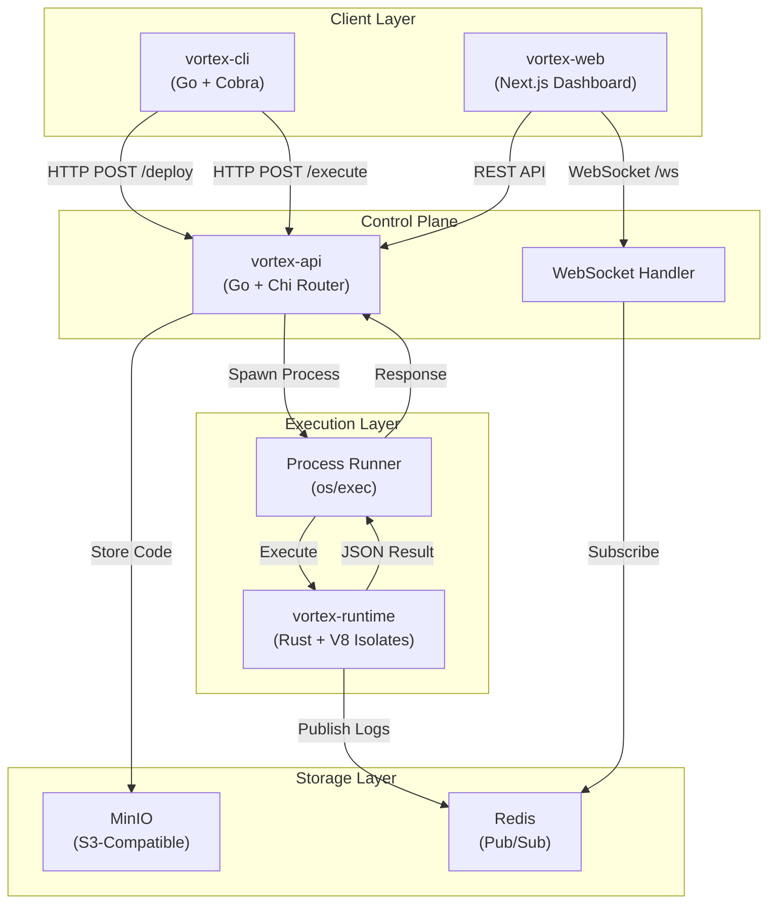

<div align="center">

# ⚡ Vortex

### A High-Performance, Geo-Distributed Serverless Runtime

[](https://www.rust-lang.org/)
[](https://golang.org/)
[](https://v8.dev/)
[](https://www.docker.com/)
[](https://redis.io/)
[](LICENSE)

**Vortex is not a Docker wrapper.** It's a production-grade serverless platform that embeds V8 Isolates directly in Rust to achieve **sub-5ms cold starts**—100x faster than container-based solutions.

[Quick Start](#-quick-start) • [Architecture](#-architecture) • [Features](#-key-features) • [Documentation](#-usage-guide) • [Engineering](#-engineering-decisions)

</div>

---

## 🎯 What is Vortex?

Vortex is a complete serverless platform inspired by Cloudflare Workers and AWS Lambda@Edge, built from scratch to demonstrate:

- **V8 Isolate Architecture**: JavaScript execution in memory-isolated sandboxes without container overhead
- **Go Control Plane**: HTTP API orchestration with concurrent worker pools
- **Real-Time Observability**: Redis Pub/Sub log streaming via WebSocket
- **Unified Deployment**: Multi-stage Docker builds packaging Rust and Go binaries

```
User Code → Go API → MinIO Storage → Rust V8 Runtime → JSON Response
                  ↓
            Redis Pub/Sub → WebSocket → Real-Time Dashboard
```

---

## 📐 Architecture



---

## ✨ Key Features

### ⚡ Zero-Copy Cold Starts

Traditional serverless platforms spin up containers for each function, incurring 100-500ms cold starts. Vortex uses **V8 Heap Snapshots** to pre-compile the JavaScript context at build time:

```rust
// Build-time: Serialize V8 heap state
let snapshot = JsRuntime::new(RuntimeOptions {
    startup_snapshot: Some(BOOTSTRAP_SNAPSHOT),
    ..Default::default()
});

// Runtime: Restore in <5ms
let runtime = JsRuntime::new(RuntimeOptions {
    startup_snapshot: Some(snapshot),
    ..Default::default()
});
```

### 🔒 Secure Sandboxing

Each function executes in an isolated V8 context via `deno_core`. Memory is completely separated between invocations:

- No shared state between functions
- No filesystem access (unless explicitly granted)
- No network access (controlled via ops)
- Configurable CPU time limits

### 🌊 Real-Time Observability

Console output streams to your terminal in real-time via Redis Pub/Sub:

```
┌─────────────┐    ┌─────────────┐    ┌─────────────┐
│  V8 Runtime │───▶│    Redis    │───▶│  WebSocket  │
│ console.log │    │   Pub/Sub   │    │   Client    │
└─────────────┘    └─────────────┘    └─────────────┘
```

### 🚀 Unified Deployment

A single Docker image contains both the Go API and Rust runtime, enabling `os/exec` subprocess communication:

```dockerfile
# Multi-stage build: Rust + Go → debian-slim
FROM rust:1.83-bookworm AS rust-builder
FROM golang:1.22-bookworm AS go-builder
FROM debian:bookworm-slim AS runtime
COPY --from=rust-builder /vortex-runtime /usr/local/bin/
COPY --from=go-builder /vortex-api /usr/local/bin/
```

### ⏱️ Async Concurrency

The `op_sleep` Tokio integration prevents `setTimeout`/`setInterval` from blocking the event loop:

```javascript
// This doesn't block the V8 thread
await new Promise(resolve => setTimeout(resolve, 1000));
console.log("Non-blocking timer!");
```

---

## 🚀 Quick Start

### Prerequisites

- [Docker](https://www.docker.com/) & [Docker Compose](https://docs.docker.com/compose/)
- [Go 1.22+](https://golang.org/) (for CLI)

### One-Command Deployment

```bash
# Clone the repository
git clone https://github.com/divitsinghall/Vortex.git
cd Vortex

# Start the entire platform
docker-compose up --build

# Services:
#   - API:      http://localhost:8080
#   - Frontend: http://localhost:3000
#   - MinIO:    http://localhost:9001
```

### Install the CLI

```bash
cd vortex-cli
go build -o vortex .

# Add to PATH (optional)
sudo mv vortex /usr/local/bin/
# Or create an alias
alias vortex="$(pwd)/vortex"
```

---

## 📖 Usage Guide

### 1. Initialize a Function

```bash
$ vortex init

 __     __         _            
 \ \   / /__  _ __| |_ _____  __
  \ \ / / _ \| '__| __/ _ \ \/ /
   \ V / (_) | |  | ||  __/>  < 
    \_/ \___/|_|   \__\___/_/\_\

→ Initializing new Vortex function...
✓ Created index.js
→ Next steps:
  1. Edit index.js to add your logic
  2. Deploy with: vortex deploy index.js
```

### 2. Write Your Function

```javascript
// index.js
console.log("🚀 Function starting...");

// Async operations work seamlessly
await new Promise(resolve => setTimeout(resolve, 100));

// Perform computation
const result = {
    message: "Hello from Vortex!",
    timestamp: new Date().toISOString(),
    computed: Array.from({ length: 5 }, (_, i) => i * i),
};

console.log("Result:", JSON.stringify(result, null, 2));

// Return data to the caller
Vortex.return(result);
```

### 3. Deploy

```bash
$ vortex deploy index.js

→ Deploying index.js (342 bytes)...
✓ Function deployed successfully!

Function ID: a1b2c3d4-e5f6-7890-abcd-ef1234567890

Run your function with:
  vortex run a1b2c3d4-e5f6-7890-abcd-ef1234567890
```

### 4. Execute

```bash
$ vortex run a1b2c3d4-e5f6-7890-abcd-ef1234567890

→ Executing function a1b2c3d4-e5f6-7890-abcd-ef1234567890...

📋 Console Output:

  [log] 🚀 Function starting...
  [log] Result: {
    "message": "Hello from Vortex!",
    "timestamp": "2024-12-15T17:30:00.000Z",
    "computed": [0, 1, 4, 9, 16]
  }

📦 Return Value:

  {
    "message": "Hello from Vortex!",
    "timestamp": "2024-12-15T17:30:00.000Z",
    "computed": [0, 1, 4, 9, 16]
  }

⏱  Executed in 142ms
```

---

## 🔬 Engineering Decisions

### Why V8 Isolates vs Docker Containers?

| Metric | Docker Container | V8 Isolate |
|--------|------------------|------------|
| Cold Start | 100-500ms | <5ms |
| Memory Overhead | 50-200MB | 2-10MB |
| Startup Model | Fork + Exec | Heap Restore |
| Isolation | Process-level | Memory-level |

Docker containers require kernel-level process isolation, filesystem mounting, and network namespace setup. V8 Isolates share the same process but maintain complete memory separation through V8's security model—the same technology that isolates browser tabs.

### The "TCP in Snapshot" Problem

V8 Heap Snapshots serialize the entire JavaScript heap state at build time. However, **OS resources like TCP connections cannot be serialized**:

```rust
// ❌ This panics when restoring the snapshot:
// "Cannot serialize external object: TcpStream"
let redis_client = connect_to_redis();
let snapshot = create_snapshot_with(redis_client);

// ✅ Solution: Initialize connections AFTER snapshot load
let runtime = restore_from_snapshot();
runtime.inject_redis_client(connect_to_redis()); // Post-load injection
```

We solved this by:
1. Creating snapshots with only serializable JavaScript context
2. Injecting Redis publishers via Rust ops after runtime initialization
3. Using `op_log` to bridge JS `console.log` to Rust's Redis client

### GLIBC Compatibility

The Rust runtime links against V8, which is compiled with glibc. Alpine Linux uses musl libc, causing:

```
Error: /lib/ld-musl-x86_64.so.1: Symbol not found: __cxa_thread_atexit_impl
```

**Solution**: Use `debian:bookworm-slim` as the base image. It provides glibc compatibility while remaining reasonably small (~80MB).

```dockerfile
# ❌ Alpine: musl libc - V8 crashes
FROM alpine:latest

# ✅ Debian Slim: glibc - V8 works
FROM debian:bookworm-slim
```

---

## 📁 Project Structure

```
Vortex/
├── vortex-runtime/          # Rust V8 Execution Engine
│   ├── src/
│   │   ├── main.rs          # CLI entrypoint
│   │   ├── worker.rs        # JsRuntime wrapper
│   │   ├── ops.rs           # Custom Deno ops (console, sleep)
│   │   └── bootstrap.rs     # JavaScript polyfills
│   ├── Cargo.toml
│   └── build.rs             # Snapshot generation
│
├── vortex-api/              # Go Control Plane
│   ├── cmd/server/main.go   # HTTP server entrypoint
│   └── internal/
│       ├── api/             # HTTP handlers
│       ├── runner/          # Process execution pool
│       ├── store/           # MinIO integration
│       └── ws/              # WebSocket handler
│
├── vortex-cli/              # Go Command-Line Tool
│   ├── main.go
│   └── cmd/
│       ├── root.go          # Base command + config
│       ├── init.go          # vortex init
│       ├── deploy.go        # vortex deploy
│       └── run.go           # vortex run
│
├── vortex-web/              # Next.js Dashboard
│   └── src/
│       ├── app/             # App Router pages
│       └── components/      # React components
│
├── Dockerfile.backend       # Multi-stage Rust + Go build
├── docker-compose.yml       # Full stack orchestration
└── README.md
```

---

## 🛠️ Development

### Local Development (Without Docker)

```bash
# Terminal 1: Start infrastructure
cd vortex-api
docker-compose up minio redis

# Terminal 2: Build Rust runtime
cd vortex-runtime
cargo build --release

# Terminal 3: Run Go API
cd vortex-api
go run cmd/server/main.go

# Terminal 4: Run frontend
cd vortex-web
npm run dev
```

### Environment Variables

| Variable | Default | Description |
|----------|---------|-------------|
| `REDIS_ADDR` | `localhost:6379` | Redis connection address |
| `MINIO_ENDPOINT` | `localhost:9000` | MinIO S3 endpoint |
| `MINIO_ACCESS_KEY` | `minioadmin` | MinIO access key |
| `MINIO_SECRET_KEY` | `minioadmin` | MinIO secret key |
| `VORTEX_RUNTIME_PATH` | Auto-detected | Path to Rust binary |

---

## 📚 API Reference

### `POST /deploy`

Deploy a new function.

```bash
curl -X POST http://localhost:8080/deploy \
  -H "Content-Type: application/json" \
  -d '{"code": "Vortex.return({hello: \"world\"});"}'
```

**Response:**
```json
{
  "function_id": "a1b2c3d4-e5f6-7890-abcd-ef1234567890"
}
```

### `POST /execute/{function_id}`

Execute a deployed function.

```bash
curl -X POST http://localhost:8080/execute/a1b2c3d4-e5f6-7890-abcd-ef1234567890
```

**Response:**
```json
{
  "output": { "hello": "world" },
  "logs": [
    { "level": "log", "message": "Hello!", "timestamp": "..." }
  ],
  "execution_time_ms": 42
}
```

### `GET /health`

Health check endpoint.

```bash
curl http://localhost:8080/health
```

**Response:**
```json
{
  "status": "healthy",
  "active_workers": 2,
  "max_workers": 10
}
```

### `WebSocket /ws/{function_id}`

Real-time log streaming during execution.

```javascript
const ws = new WebSocket('ws://localhost:8080/ws/a1b2c3d4-...');
ws.onmessage = (event) => {
  const log = JSON.parse(event.data);
  console.log(`[${log.level}] ${log.message}`);
};
```

---

## 🗺️ Roadmap

- [ ] **Edge Deployment**: Geo-distributed runtime nodes
- [ ] **Cron Triggers**: Scheduled function execution
- [ ] **KV Storage**: Durable key-value store per function
- [ ] **Metrics Dashboard**: Prometheus + Grafana integration
- [ ] **TypeScript Support**: Direct `.ts` file execution
- [ ] **WASM Modules**: WebAssembly function support

---

## 📄 License

MIT License. See [LICENSE](LICENSE) for details.

---

<div align="center">

**Built with ❤️ using Rust, Go, and V8**

[Report Bug](https://github.com/divitsinghall/Vortex/issues) • [Request Feature](https://github.com/divitsinghall/Vortex/issues)

</div>
